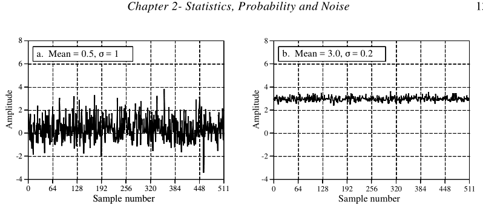
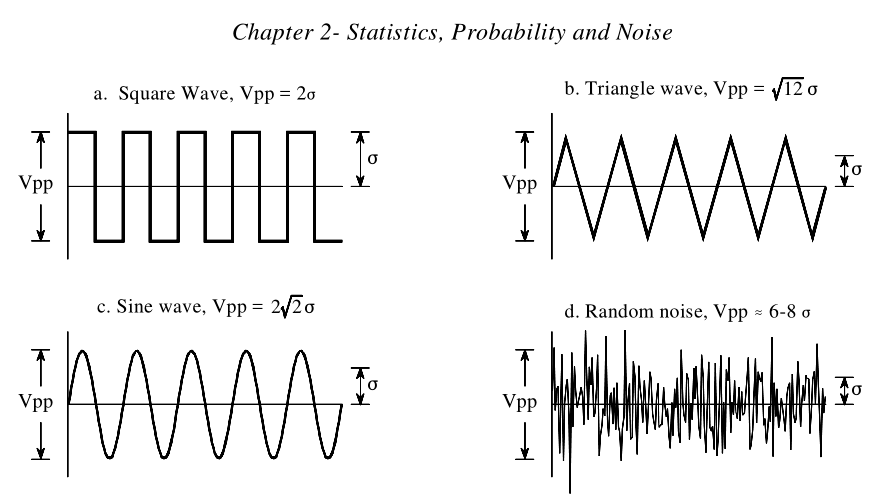

# 第二章 统计、概率和噪声

数字信号处理过程中会使用统计和概率来描述信号及其产生的过程。例如，DSP的一个主要用途就是减少我们获得的数据中的干扰、噪音以及其他不想要的部分。这些可能是测量到的数据的本身就存在的，产生的原因可能是数据采集系统本身的缺陷，又或者是一些DSP操作所带来的无法避免的副作用。统计以及概率能够测量以及分类这些破坏性特征。这是定制策略去消除有问题组件的第一步。这一章节会介绍统计以及概率中最重要的概念，重点说下它们是如何应用到我们所获得的信号上的。

## 信号与图形术语

信号是对一个参数与另一个参数的关系的描述。例如：模拟电子学中最常见的信号类型是电压随着时间而变化。由于两个参数都可以假设是一个连续范围内的值，我们可以将其称为连续信号。相比之下，把信号经过模数转换器进行量化。例如，以1000采样率12位深度转换后，电压数值被限制在了4096（2^12）个级别，而时间则是以1ms递增。这种经过量化的参数组成的信号我们称之为是离散信号或者数字信号。在大多数时候，连续信号在大自然中存在，离散信号则在电脑中使用。（当然也有例外）。也有部分信号是其中一个参数是连续的，但另一个参数是离散的情况。由于这些混合信号很少见，因此没有给它们指定特定的名称，但还是是要说明这两个参数的性质。

图2-1 展示了两个从数据采集系统获得的离散信号，竖直方向坐标表示电压、光线强度、声压或者其他。因为我们并不知道它代表了什么，因此我们统一称它是振幅（amplitude）。这个参数也有很多其他的说法：y轴、因变量、范围或者是纵坐标。

水平方向坐标表示这个信号的其他参数，其名称如下：x轴、自变量、域或者横坐标。在我们获得的数据中，水平方向的坐标大部分情况下都是表示时间。但是在其他一些特定场景，也会用其他参数来表示。例如，地理学家可能在地球表面进行等间距的岩石密度测量。为了更加通用，我们将统一使用“样本号”来简单地标记水平方向变量。如果这是一个连续信号，则会使用“时间”、“距离”、“x”等来标记水平轴。

构成信号的两个参数一般来说是不能够互换的。y轴的参数（因变量）可以说是x轴（自变量）的一个函数。换句话说，自变量描述来什么时候以及怎么采集每个样本，而因变量则是所采集的样本。在指定来x轴的值后，我们总能找到在y轴找到对应的数值，但一般不会反过来。

需要特别注意的是“域”这个词，这是个在DSP中使用非常广泛的术语。例如，一个使用时间作为自变量的信号（即水平轴的参数），我们称之在时域信号。另一种在DSP中常见的信号使用频率作为自变量，我们称之为频域信号。同样的，使用距离作为自变量的信号被称为在空间域中（距离是空间的度量）。水平轴上的变量类型，就是信号的域，就这么简单。那如果x轴被标记为一般性通用的东西，比如样本号呢？作者通常将这些信号称为时域信号。这是因为在相等的时间间隔内采样是获得信号的最常见的方法，我们也没有其他更精确的名字来称呼它。

虽然在图2-1中的信号是离散的，但它们在图中显示为连续但线。因为如果把每个样本都单独标记，就会因为数量过多而变得无法区分。在较短的信号图中，例如少于100个样本的，通常会显示单个样本的标记。需不需要在样本之间进行连线，取决于作者希望你怎么观察这些数据。例如，连续的线可以表示出样本之间的变化，又或者仅仅是帮助读者不会因为噪音数据而看瞎眼。重点是，根据水平轴标记来确定你在处理的是离散还是连续信号，不要依赖于软件的描绘采样点的方式。

变量N，在DSP中经常用来表示信号中样本总数。例如，在图2-1的信号中，N=512。为了把数据组织起来，将每个样本都标记了样本号或者索引。这些数字就是水平轴上显示的数字。我们常用的索引标记有两种，第一个索引范围是从1到N（如：1-512）。第二种的范围是0到N-1（如：0-511）。数学家经常使用第一种（1-N），但其他DSP处理通常会用第二种（0-N-1）。在本书中，我们会使用第二种索引方式。不要认为这个问题无关紧要，在未来的使用中这个问题会经常困扰你，要小心。



图2-1

## 平均值与标准差

平均值，用 $\mu$ 表示（希腊字母mu的小写形式），是统计学家对信号的平均值对行话。计算方法就是你想的那样：所有样本加起来然后除以N，用数学等式表示为：

$$ \mu = \frac{1}{N} \sum_{i=0}^{N-1} x_i  $$

等式2-1

简单来说就是对信号中的数值求和，累加$x_i$，i从0到N-1，最后除以N。等同于等式 $\mu = (x_0+ x_1+ x_2+ \ldots + x_{N-1}) / N$。如果你对于用来表示总和对求和符号 $\sum$ 不熟悉，可以好好学下这些等式，然后使用表格2-1中列出对程序进行比较。DSP中会大量使用这种求和，你需要完全理解它对意义。

在电子学中，平均值经常被称为DC值（direct current）。同样的，AC（alternating current）表示信号如何在平均值附近波动。如果信号只是一个简单的重复波形，例如正弦波或者方波，那么它的偏移可以用波峰之间的振幅来描述。遗憾的是，在获得的大多数信号中，都不会显示出明确的波峰值，更多的是随机的值，如图2-1中显示的一样。在这种情况下，必须使用一种更加通用的方式，标准差，用 $\sigma$ （希腊字母sigma的小写形式）表示。 

首先，$\left| x_i-\mu\right|$ 表示样本 $x^{th}$ 偏离平均值的距离。通过累加所有样本的偏离值，再除以样本总数N，就得到了平均偏差。要注意的是，我们在累加前计算了其绝对值，否则正数和负数会相互抵消得到0值。平均偏差提供了一个表示样本与平均值典型距离的数字。平均偏差虽然简单明了，但几乎从未用于统计学。这是因为它与信号操作的物理原理不太吻合。在大多数情况下，重要的参数并不是偏离平均值，而是偏离平均值所代表的能量。例如，当随机噪声信号在电子电路中合并时，所得到的噪声等于各个信号合并的能量，而不是合并的振幅。

标准差鱼平均偏差类似，除了其平均值时通过能量计算而不是振幅。怎么做呢？在求平均值之前把偏差进行平方就可以了。（记住：能量与电压的平方成正比）最后，取平方根来补偿初始的平方，通过方程式来表示就是：

$$ \sigma^2 = \frac{1}{N-1}\sum_{i=0}^{N-1}(x_i-\mu)^2 $$

等式2-2

注解：计算信号的标准差。信号数据存储在$x_i$中， $\mu$为平均值，N是采样总数， $\sigma$为标准差

标准差还有另一种表示： $\sigma = \sqrt{((x_0-\mu)^2+(x_1-\mu)^2+\ldots+(x_{N-1}-\mu)^2)/(N-1)}$。注意，平均值是除以 N-1而不是N，这个方程的这个微妙特征我们将在下一节中讨论。术语 $\sigma^2$在统计中经常出现，命名为**方差**。标准差是信号与平均值波动幅度的度量。方差代表了这种波动的能量。另一个你要熟悉的术语是**rms（root-mean-square）均方根**，经常在电子工程中使用。根据定义，标准差仅仅测量信号的交流部分，而均方根值则测量交流和直流分量，如果信号没有直流分量，则其均方根值等于其标准差，图2-2展示了标准差和几种常见波形的波峰峰值之间的关系。



图2-2,几种常见波形的波峰振幅与标准差的比值关系。对于方波，比率为2。三角波比率为 $\sqrt{12}=3.46$，正弦波则是$2\sqrt{2}=2.83$。尽管随机噪声没有确切的波峰振幅，但比例大约为标准差的6~8倍。

表格2-1列举了根据等式2-1和2-2计算平均值以及标准差的计算机例子。本书中的程序旨在以最直接的方式表达算法，所有其他的因素均视为次要因素。为了让程序逻辑更清晰，故不考虑良好的编程技术。例如：使用简化的BASIC，包括行号，控制结构只使用FOR-NEXT循环，没有输入/输出语句等等。可以将这些程序视为理解DSP中使用的等式的另一种方式。如果你理解不了等式，那么代码可能能帮助你更好的理解它。在BASIC语言中，变量名称末尾的%号表示它是一个整数。所有的其他变量均为浮点数。我们会在第四章中详细讨论这些变量的细节。

```basic
100 CALCULATION OF THE MEAN AND STANDARD DEVIATION
110 '
120 DIM X[511] 'The signal is held in X[0] to X[511]
130 N% = 512 'N% is the number of points in the signal
140 '
150 GOSUB XXXX 'Mythical subroutine that loads the signal into X[ ]
160 '
170 MEAN = 0 'Find the mean via Eq. 2-1
180 FOR I% = 0 TO N%-1
190 MEAN = MEAN + X[I%]
200 NEXT I%
210 MEAN = MEAN/N%
220 '
230 VARIANCE = 0 'Find the standard deviation via Eq. 2-2
240 FOR I% = 0 TO N%-1
250 VARIANCE = VARIANCE + ( X[I%] - MEAN )^2
260 NEXT I%
270 VARIANCE = VARIANCE/(N%-1)
280 SD = SQR(VARIANCE)
290 '
300 PRINT MEAN SD 'Print the calculated mean and standard deviation
310 '
320 END
```

表格2-1

这种计算平均值和标准差的方法足以满足许多应用场景的需求。但是它有两个局限性。首先，如果均值比标准差大得多，等式2-2则需要减去两个非常接近的数值，这会导致计算中舍入的误差过大，我们会在第四章详细讨论这个问题。其次，当获取了新样本并将其添加到信号中后，需要重新计算平均值和标准差。我门将这种计算称为：**运行统计**。虽然等式2-1和2-2可以运用在运行统计中，但它要求每次新的运算都需要包含所有的样本值，这对计算机的算力和内存的使用是非常低效的。

通过变换等式可以解决这个问题，等式2-1和2-2提供了另一个用于计算标准差的等式：

$$ \sigma^2 = \frac{1}{N-1}(\sum_{i=0}^{N-1}x_i^2 - \frac{1}{N}(\sum_{i=0}^{N-1}x_i)^2) $$

或者简单表示为:

$$ \sigma^2 = \frac{1}{N-1}( 平方和 - \frac{和的平方}{N}) $$

等式2-3：使用运行统计计算标准差。此等式的结果与等式2-2相同，但舍入噪声更低，计算效率也更高。信号使用三个累加的参数表示：N为总采样数；sum为采样值的总和；平方和为采样值的平方和。然后从这三个值计算出标准差。

当遍历信号中的采样时，运行提示会保留三个参数：（1）已处理的样本数。（2）采样值的总和。（3）采样值的平方和（即每个样本的值的平方，然后将结果加到累加值中）。这样一来，在处理了任意数量的样本后，仅使用三个参数的当前值就可以有效的计算出平均值和标准差。表2-2展示了一个程序，该程序就以这种方式计算了平均值和标准差，同时考虑了每个新样本。这是手持计算器中用于查找数字序列统计信息的方法，每次输入数字并按下$\sum$求和键，三个参数都会更新。然后可以在需要的时候找到平均值和标准差，而不必计算整个序列。

```BASIC
100 'MEAN AND STANDARD DEVIATION USING RUNNING STATISTICS
110 '
120 DIM X[511] 'The signal is held in X[0] to X[511]
130 '
140 GOSUB XXXX 'Mythical subroutine that loads the signal into X[ ]
150 '
160 N% = 0 'Zero the three running parameters
170 SUM = 0
180 SUMSQUARES = 0
190 '
200 FOR I% = 0 TO 511 'Loop through each sample in the signal
210 '
220 N% = N%+1 'Update the three parameters
230 SUM = SUM + X[I%]
240 SUMSQUARES = SUMSQUARES + X[I%]^2
250 '
260 MEAN = SUM/N% 'Calculate mean and standard deviation via Eq. 2-3
270 IF N% = 1 THEN SD = 0: GOTO 300
280 SD = SQR( (SUMSQUARES - SUM^2/N%) / (N%-1) )
290 '
300 PRINT MEAN SD 'Print the running mean and standard deviation
310 '
320 NEXT I%
330 '
340 END
```

表格2-2

在结束关于平均值和标准差的讨论前，需要提一下另外两个术语。在某些情况下，平均值描述了要测量的内容，而标准差则代表了噪声和其他干扰。在这种情况下，标准差本身并不重要，重要的时其与平均值的比值。于是产生了术语：**信号对噪声比（SNR）**，这是通过平均值除以标准差得到的。这里还使用了另一个术语：**变异系数（CV）**。它的定义是标准差除以平均值在乘以100%。例如：CV为2%的信号（或者其他测量值）的SNR为50.更好的数据意味着SNR更高而CV更低。

## 信号与基本过程

统计学是解释数字数据(例如采集的信号)的科学。相比之下，DSP中用概率来理解生成信号的过程。尽管**信号采集**和**基本过程**是密切相关的，但是在许多DSP技术中，他们之间的区别才是关键。

例如，假设通过翻转硬币1000次来创建1000点信号。如果硬币为正面，则将相应的样本的值记为1，反之则记为0。则产生次信号的过程的平均准确度为0.5，这取决于每种可能结果的相对概率：正面50%，反面50%。但是，实际的1000点信号的平均值不太可能恰好为0.5。随机会使得每次产生信号时，1和0的数量都会略有不同。基本过程的概率是恒定的，但是每次重复实验时，获取信号的统计信息都会发生变化。在实际数据中发现的这种随机不规则形被称为“统计变化”、“统计波动”和“统计噪声”。

这会带来一些问题。当你看到一下术语时：平均值和标准差，你怎么知道作者指的是实际信号的统计信息，还是创建信号的基础过程的概率？遗憾的是，你只能通过上下文来判断。统计和概率中使用的所有术语并不都是这样的。例如，直方图和概率质量系数（在下一张中讨论）的概念和它的名称是相互匹配的。

现在，我们回到计算标准差的等式2-2。如前所述，在计算平均偏差的平均值时，此等式除以N-1.而不是简单的除以N。要理解为什么这样，请想象你要查找某个生成信号的过程的平均值和标准差。为此，你将从过程中获取N个样本信号，然后通过等式2-1计算信号的平均值。然后你可以将其用作基本过程的平均值的估计。但是，由于统计噪声的存在，你知道会存在错误。特别的，对于随机信号，N的均值与基本过程均值之间的典型误差由下面的这个等式给出：

$$ Typical\quad error = \frac{\sigma}{N^{\frac{1}{2}}} $$

等式2-4：通过使用有限样本N计算基本过程的平均值时的典型误差，参数$\sigma$时标准差

如果N比较小，则计算平均值中的统计噪声将非常大。换句话说，你没有访问到足够多的数据来正确描述过程。N的值越大，预期的误差就会越小。概率论的一个里程碑*大数定律*可确保当N接近无穷大时，误差将变为0。

下一步，我们要计算所采集信号的标准差，并将其用作基本过程标准差的估计。现在的问题在于，在使用等式2-2计算标准差之前，你需要知道均值$\mu$，但你不知道基本过程的平均值，仅知道N点信号的平均值，且该信号包含由于统计噪声引入的五擦汗。该误差倾向于减小标准差的计算值。为了对此进行补偿，N被替换为N-1.如果N足够大，则误差无关紧要，如果N较小，则此替换可以使基本过程的标准差的估算更加准确。也就是说，等式2-2是对基本过程的标准差的估计。如果我们在等式中除以N，得到的则是采集信号的标准差。

为了更好的说明这种想法，请查看图2-3中的信号。并思考：这些信号的变化是统计噪声的结果，还是基本过程正在发生改变？我们不难相信，对于随机机会来说这些变化太大了，而且必须与基本过程相关。以这种方式改变其特征的过程称为**非平稳过程**。相比之下，之前在图2-1中显示的信号是通过平稳过程生成的，而变化完全是由统计噪声引起的。图2-3b说明了非平稳信号的一个常见问题：平均值的缓慢变化会干扰标准差的计算。在此示例中，信号的标准差在很短间隔内时，值为1。但是整个信号的标准差为1.16。通过把信号分割成很短的切片并分别计算每个切片的统计信息，几乎可以消除这种错误。如果需要，每个切片的标准差可以取平均值从而得到单个值。

## 直方图，Pmf和pdf
